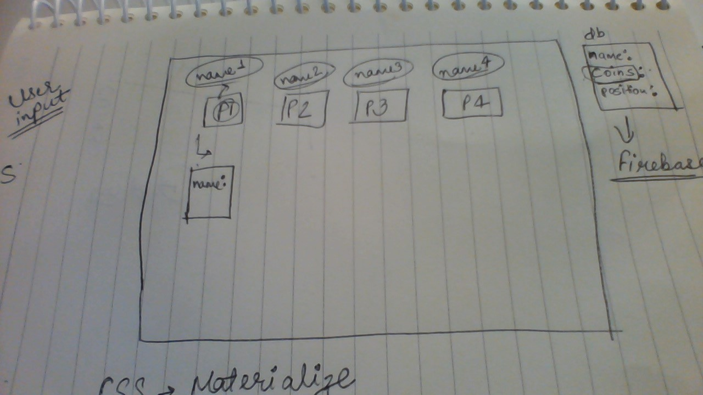
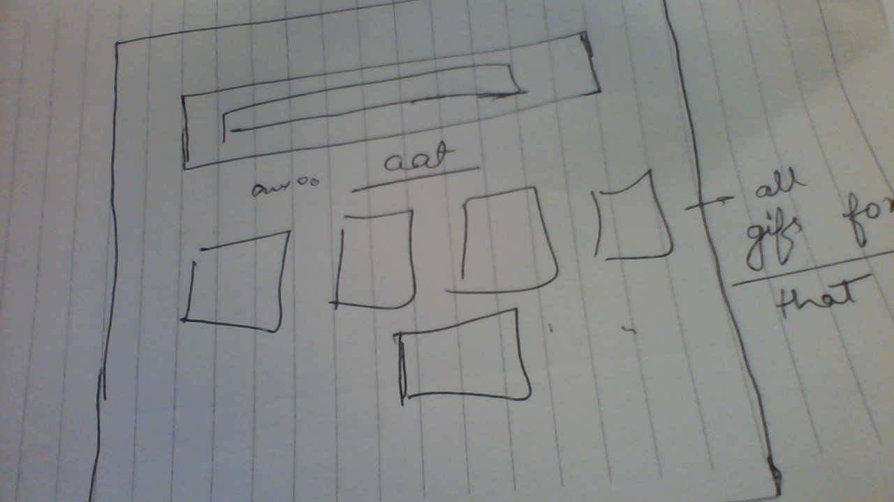
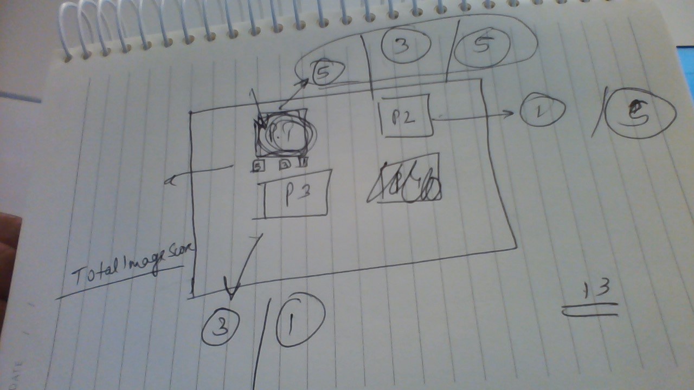

# GiphyBidder

Build an online game multi-player to find a funny gif to respond to the provided sentence/quote.
Checkout the app. [Live](http://giphybidder.tk/)

1. Who is your target audience?
- full time students
- people with time
- anyone

2. What is the problem that the product will address?
- boredom
- lack of competition
- help the players find a way to fight boredom and lack of competition with word image association

3. What is the primary goal of the product?
- entertain
- to win
- provide the users a way to escape the boredom of everyday life and intereact with their friends while bringing some challene and laughs

4. User stories
- be able to select a player to begin game
- change player name
- the game will present a question/quote so that the user can search a gif to respond the question or complete the quote
- the user selects an image that represents their best answer.
- all players get to see all the selected images in random order.
- Players should be able to bid on the images displayed.
- Once everyone has bid, we should be able to assign "total value" to each image and display the winning image and player corresponding to that image.
Optional/ Addon:-
- After "n" rounds, final scoreboard should be displayed! with option to restart or replay the game(with same players) display the gifs selected and words used to search

## Team 🎮

- Stanley
- Neha
- Héctor

## Description 📜

Select a gif that will best fit a provided sentence and receive the most coins from other players on each round. At the end of all rounds, the player with most top gifs wins. 

## Sketch 🖌

## API 💻

- [Open Trivia DB](https://opentdb.com/api_config.php)
- [Giphy](https://developers.giphy.com/)

## Tasks ✔️

- Each player begins with coins with a total value of 10 each round
- A random sentence is given
- Each player has 30s to select a gif that will represent that sentence the best
- search with any set of terms
- see a list of 7 results
- select one or search again
- Once everyone has selected gifs, the search for the best gif begins
- Each player gets to see each other's selections without knowing the owner (insert funny description of player)
- Assign all of your coins to players (you must use all of your coins)
- show all the images
- every 2 seconds show the gif from last to first
- the image with the most coins wins the round

Coins distribution per number of players 💰

- 4 players
- 5,3,1
- 5 players
- 4,3,1,1
- 6 players
- 4,2,1,1

